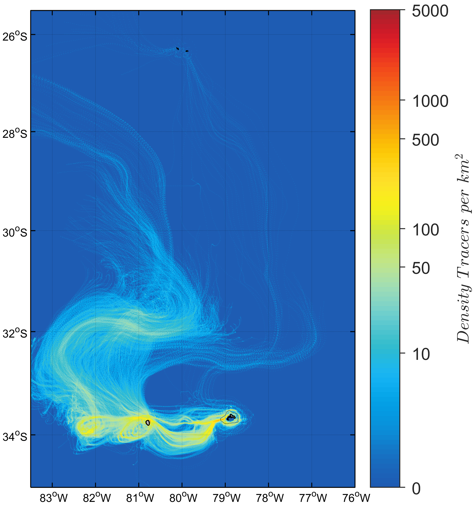

# **IchtConnectivity:** Tracking Connectivity between Archipelagos

This GitHub repository contains a set of MATLAB functions designed for analyzing and visualizing particle tracking data generated by the [ichthyop model](https://ichthyop.org/). The functions are tailored to assess particle connectivity and retention in marine systems, particularly focusing on the interactions between different subsystems.

## Files and Functions

1. **`ichthyop_conectividadIDJFAv1.m`**

    - This function creates a 3D matrix (particles, tracking days, release) based on the output of ichthyop stored in netCDF files.

2. **`TrackIchthyopConectividadoutRetencionv1.m`**

    - Determines trajectories by system (AS, RCSC, ID) that originated in one system and passed through another. The information is saved in 2D matrices where the nomenclature refers to the origin system. If a matrix is empty, it indicates that the system did not connect with another during the tracking period.

3. **`TrackIchthyopRetencionv1.m`**

    - Similar to the previous function but evaluates, for a specific period (e.g., day 360), whether the particle still persists in the system where it was released.

4. **`puntosliberacionIDJF_Nov`**

    - This text file contains all the positions where particles were released for the month of November. These positions are used in the two functions above to determine domains around the islands.

5. **`densIchthyopConectividadmxIslasv1.m`**

    - Determines the spatial density of particles released by an island that connected with another. This function also generates the corresponding figure for each release.

6. **`densIchthyopRetencionmxIslasv1.m`**

    - Similar to the previous function, but in this case, it corresponds to paths of particles that are retained.

## Usage

To use these functions, follow the steps outlined below:

1. Download or clone the repository.
2. Ensure you have MATLAB installed.
3. Open MATLAB and navigate to the repository directory.
4. Run the desired MATLAB script according to your analysis needs.

---

# **IchtConnectivity:** Conectividad entre Archipiélagos

Este repositorio de GitHub contiene un conjunto de funciones MATLAB y archivos de datos diseñados para analizar y visualizar datos de seguimiento de partículas generados por el modelo ichthyop. Las funciones están diseñadas para evaluar la conectividad y retención de partículas en sistemas marinos, centrándose en las interacciones entre diferentes subsistemas.

## Archivos y Funciones

1. **`ichthyop_conectividadIDJFAv1.m`**

    - Esta función crea una matriz 3D (partículas, días de seguimiento, liberación) basada en las salidas de ichthyop almacenadas en archivos netCDF.

2. **`TrackIchthyopConectividadoutRetencionv1.m`**

    - Determina trayectorias por sistema (AS, RCSC, ID) que se originaron en un sistema y pasaron por otro. La información se guarda en matrices 2D donde la nomenclatura hace referencia al sistema de origen. Si una matriz está vacía, indica que el sistema no se conectó con otro durante el período de seguimiento.

3. **`TrackIchthyopRetencionv1.m`**

    - Similar a la función anterior pero evalúa, para un período específico (por ejemplo, día 360), si la partícula aún persiste en el sistema donde fue liberada.

4. **`puntosliberacionIDJF_Nov`**

    - Este archivo de texto contiene todas las posiciones donde se liberaron partículas para el mes de noviembre. Estas posiciones se utilizan en las dos funciones anteriores para determinar dominios alrededor de las islas.

5. **`densIchthyopConectividadmxIslasv1.m`**

    - Determina la densidad espacial de las partículas liberadas por una isla que se conectaron con otra. Esta función también genera la figura correspondiente a cada liberación.

6. **`densIchthyopRetencionmxIslasv1.m`**

    - Función similar a la anterior, pero en este caso corresponde a rutas de partículas que están retenidas.

## Uso

Para utilizar estas funciones, siga los pasos descritos a continuación:

1. Descargue o clone el repositorio.
2. Asegúrese de tener MATLAB instalado.
3. Abra MATLAB y navegue al directorio del repositorio.
4. Ejecute el script MATLAB deseado según sus necesidades de análisis.
